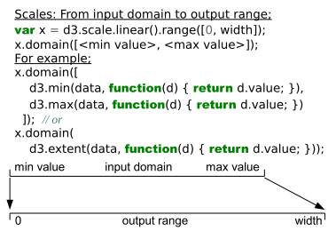
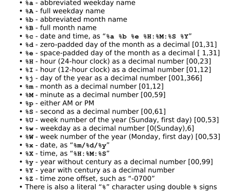

## Streamgraph
<iframe src='assets/html/Streamgraph.html' width = '800px' height = '250px'></iframe>

*** =pnotes

For continuous data such as time series, a streamgraph can be used in place of stacked bars. This example also demonstrates path transitions to interpolate between different layouts. Streamgraph algorithm, colors, and data generation inspired by [Byron and Wattenberg](http://www.leebyron.com/else/streamgraph/).  

http://bl.ocks.org/mbostock/4060954

---

## Voronoi Tessellation
<iframe src='assets/html/VoronoiTessellation.html' width = '960px' height = '600px'></iframe>

*** =pnotes

The Voronoi tessellation shows the closest point on the plane for a given set of points. This example updates the Voronoi diagram in response to mouse interaction! Colors by Cynthia Brewer; algorithm by Steven Fortune; implementation based on work by Nicolas Garcia Belmonte; interaction inspired byRaymond Hill. 

http://bl.ocks.org/mbostock/4060366

---

## Bubble Chart

<iframe src='assets/html/BubbleChart.html' width = '960px' height = '600px'></iframe>

*** =pnotes

Bubble charts encode data in the area of circles. Although less perceptually-accurate than bar charts, they can pack hundreds of values into a small space. Implementation based on work by Jeff Heer. Data shows the Flare class hierarchy, also courtesy Jeff Heer.  

http://bl.ocks.org/mbostock/4063269


--- &carousel .span12 #mycarouselslide

*** {class: active, img: "assets/img/ZoomableGeography.png"}

Zoomable Geography  

http://bl.ocks.org/mbostock/2374239


*** {img: "assets/img/Choropleth.png"}

This choropleth encodes unemployment rates from 2008 with a quantize scale ranging from 0 to 15%. Athreshold scale is a useful alternative for coloring arbitrary ranges.  

http://bl.ocks.org/mbostock/4060606


*** {img: "assets/img/WordCloud.png"}

[Word Cloud Generator](http://www.jasondavies.com/wordcloud/#%2F%2Fwww.jasondavies.com%2Fwordtree%2Fcat-in-the-hat.txt)


*** {img: "assets/img/CodeFlower.png"}

[CodeFlower Source code visualization](http://redotheweb.com/CodeFlower/) visualizes source repositories using an interactive tree. Each disc represents a file, with a radius proportional to the number of lines of code (loc). 

<style>
#mycarouselslide img {
  width: 800px;
  height: 600px;
}
</style>

--- .segue .dark

## Using Canvas and SVG to draw

--- 

## Canvas Demo

 	var mySmile = document.getElementById('mySmile');
 	var smileCtx = mySmile.getContext('2d');
 	var radgrad = smileCtx.createRadialGradient(100,100,10,100,100,100);  
 	radgrad.addColorStop(.5, 'rgba(247,241,192,1)');  
 	radgrad.addColorStop(1, 'rgba(244,225,56,1)');  
 	// head
 	smileCtx.beginPath();smileCtx.fillStyle = radgrad;smileCtx.arc(100,100,99,0,Math.PI*2);
 	smileCtx.stroke();smileCtx.fill();
 	// Mouth
 	smileCtx.beginPath();smileCtx.moveTo(170,100);
 	smileCtx.arc(100,100,70,0,Math.PI);smileCtx.stroke();
 	// Left eye
 	smileCtx.beginPath();smileCtx.fillStyle = 'black';smileCtx.moveTo(60, 65);
 	smileCtx.arc(60,65,12,0,Math.PI*2);smileCtx.fill();
 	// Right eye			
 	smileCtx.beginPath();smileCtx.moveTo(140,65);
 	smileCtx.arc(140,65,12,0,Math.PI*2);smileCtx.fill();

*** =pnotes

<iframe src='assets/html/canvas.html' width = '200px' height = '200px' seamless></iframe>

--- 

## SVG Demo

 	<svg version="1.1"
 	     baseProfile="full"
 	     xmlns="http://www.w3.org/2000/svg">
 	  <circle cx="300" cy="164" r="160" fill="yellow" stroke="black" stroke-width="2" />
 	  <circle cx="210" cy="100" r="20" fill="black" />
 	  <circle cx="380" cy="100" r="20" fill="black" />
 	  <clipPath id="MyClip">
 	    <rect x="30" y="200" width="600" height="100" />
 	  </clipPath>
 	  <circle cx="300" cy="160" r="120" fill-opacity="0" stroke="black" stroke-width="5" 
 		clip-path="url(#MyClip)" />
 	</svg>

*** =pnotes

<iframe src='assets/html/svg.html' width = '960px' height = '600px' seamless></iframe>

--- &twocol .bigger

## Canvas V.S. SVG

[Read more...](http://msdn.microsoft.com/zh-cn/library/gg193983)

*** =left

### Canvas

> -  depends on resolution
> -  doesn't support DOM events
> -  weaker ability to render text
> -  can save image as .jpg or .png files
> -  most suitble for image-dense games in which lots of objects gets re-drawed

*** =right

### SVG

> -  independent of resolution (can be enlarged without comprise)
> -  supports DOM events
> -  more complexity will slow down web response time
> -  suitable for large rendering area such as Google Map
> -  cannot save as image files
> -  doesn't suit games

--- .segue .dark

## Basic SVG

> - ### Scalable Vector Graphics has been around for more than a decade.  

> - ### It is a XML-based and text-based image format. Each SVG image is defined using markup code similar to HTML, and SVG code can be included within any HTML document, or inserted dynamically into the DOM.

--- 

## Elements

> - ### The SVG element
  Before you can draw anything, you must create an SVG element. Think of the SVG element as a canvas on which your visuals are rendered. (In that respect, SVG is conceptually similar to HTML’s canvas element.) 

> - ### Simple Shapes
  There are a number of visual elements that you can include between those svg tags, including `rect`, `circle`, `ellipse`, `line`, `text`, and `path`.
  
> - ### Coordinates 
  If you’re familiar with computer graphics programming, you’ll recognize the usual pixel-based coordinates system in which 0,0 is the top-left corner of the drawing space. 

*** =pnotes

<svg width="505" height="65">
    <line x1="5" y1="5" x2="5" y2="50" stroke="gray" stroke-width="1"></line>
    <line x1="5" y1="50" x2="0" y2="45" stroke="gray" stroke-width="1"></line>
    <line x1="5" y1="50" x2="10" y2="45" stroke="gray" stroke-width="1"></line>
    <line x1="5" y1="5" x2="500" y2="5" stroke="gray" stroke-width="1"></line>
    <line x1="500" y1="5" x2="495" y2="0" stroke="gray" stroke-width="1"></line>
    <line x1="500" y1="5" x2="495" y2="10" stroke="gray" stroke-width="1"></line>
    <circle cx="5" cy="5" r="3" fill="#008"></circle>
    <text x="10" y="20">0,0</text>
    <circle cx="105" cy="25" r="3" fill="#008"></circle>
    <text x="110" y="40">100,20</text>
    <circle cx="205" cy="45" r="3" fill="#008"></circle>
    <text x="210" y="60">200,40</text>
</svg>

--- 

## Simple Shapes

### rectangle

```html
<rect x="0" y="0" width="500" height="50"/>
```
<svg width="500" height="50">
    <rect x="0" y="0" width="500" height="50"></rect>
</svg>

### circle

```html
<circle cx="250" cy="25" r="25"/>
```
<svg width="500" height="50">
    <circle cx="250" cy="25" r="25"></circle>
</svg>

### ellipse

```html
<ellipse cx="250" cy="25" rx="100" ry="25"/>
```
<svg width="500" height="50">
    <ellipse cx="250" cy="25" rx="100" ry="25"></ellipse>
</svg>

--- 

### line

```html
<line x1="0" y1="0" x2="500" y2="50" stroke="black"/>
```
<svg width="500" height="50">
    <line x1="0" y1="0" x2="500" y2="50" stroke="black"></line>
</svg>

### text

```html
<text x="250" y="25" font-family="sans-serif"
 font-size="25" fill="gray">Easy-peasy</text>
```
<svg width="500" height="50">
    <text x="250" y="25" font-family="sans-serif" font-size="25" fill="gray">Easy-peasy</text>
</svg>

### path

> path is for drawing anything more complex than the shapes above (like country outlines for geomaps)

--- 

## Styling SVG Elements

* `fill` -- A color value. Just as with CSS, colors can be specified as
    - named colors -- orange
    - hex values -- #3388aa or #38a
    - RGB values -- rgb(10, 150, 20)
    - RGB with alpha transparency -- rgba(10, 150, 20, 0.5)
* `stroke` -- A color value.
* `stroke-width` -- A numeric measurement (typically in pixels).
* `opacity` -- A numeric value between 0.0 (completely transparent) and 1.0 (completely opaque).

</br>
> For more on SVG -- including paths, clip-paths, masks, and filters -- see ["An SVG Primer for Today’s Browsers"](http://www.w3.org/Graphics/SVG/IG/resources/svgprimer.html) by David Dailey.

*** =pnotes

```html
<circle cx="25" cy="25" r="20" fill="purple" 
        stroke="green" stroke-width="10"
        opacity="0.9"/>
<circle cx="65" cy="25" r="20" fill="green"
        stroke="blue" stroke-width="10"
        opacity="0.5"/>
<circle cx="105" cy="25" r="20" fill="yellow"
        stroke="red" stroke-width="10"
        opacity="0.1"/>
```

<svg width="500" height="50">
    <circle cx="25" cy="25" r="20" fill="purple" stroke="green" stroke-width="10" opacity="0.9"></circle>
    <circle cx="65" cy="25" r="20" fill="green" stroke="blue" stroke-width="10" opacity="0.5"></circle>
    <circle cx="105" cy="25" r="20" fill="yellow" stroke="red" stroke-width="10" opacity="0.1"></circle>
</svg>

--- .segue .dark

## Walk Through Basic D3.js Usage

--- &twocol

## General Steps:

*** =left

> - ### Create svg element, set up dimension

> - ### Define the output range

> - ### Get data

> - ### Set input domain according to the data

> - ### Enter the data

> - ### Add axies

> - ### More details such as text, grids etc.

*** =right

<iframe src='assets/html/scatter.html' width = '500px' height = '500px' seamless></iframe>

--- 

## Define the layout

```JavaScript
            //Width and height
    		var w = 500;
			var h = 300;
			var padding = 30;
            
			//Create SVG element
			var svg = d3.select("body")
						.append("svg")
						.attr("width", w)
						.attr("height", h);
                        
			//Create scale functions
			var xScale = d3.scale.linear()
								 .range([padding, w - padding * 2]);
			var yScale = d3.scale.linear()
								 .range([h - padding, padding]);
			var rScale = d3.scale.linear()
								 .range([2, 5]);
```

*** =pnotes

> "Scales are functions that map from an input domain to an output range."

</img>

--- 

## Get Data

```JavaScript
//Dynamic, random dataset
var dataset = [];					//Initialize empty array
var numDataPoints = 50;				//Number of dummy data points to create
var xRange = Math.random() * 1000;	//Max range of new x values
var yRange = Math.random() * 1000;	//Max range of new y values
for (var i = 0; i < numDataPoints; i++) {					//Loop numDataPoints times
	var newNumber1 = Math.round(Math.random() * xRange);	//New random integer
	var newNumber2 = Math.round(Math.random() * yRange);	//New random integer
	dataset.push([newNumber1, newNumber2]);					//Add new number to array
}
```

In web development, we can use `d3.json()` instead of `$.ajax()`

--- &twocols

## Enter the Data

*** =left

```JavaScript
//Set input domain
xScale.domain([0, d3.max(dataset, 
    function(d) { return d[0]; })]);

yScale.domain([0, d3.max(dataset, 
    function(d) { return d[1]; })]);

rScale.domain([0, d3.max(dataset, 
    function(d) { return d[1]; })]);
``` 
    
*** =right

```JavaScript
//Create circles
svg.selectAll("circle")
   .data(dataset)
   .enter()
   .append("circle")
   .attr("cx", function(d) {
   		return xScale(d[0]);
   })
   .attr("cy", function(d) {
   		return yScale(d[1]);
   })
   .attr("r", function(d) {
   		return rScale(d[1]);
   });
``` 
*** =pnotes

<iframe src='assets/html/scatter_data.html' width = '900px' height = '500px' seamless></iframe>

--- &twocols

## Create Axises

*** =left

```JavaScript
//Define X axis
var xAxis = d3.svg.axis().scale(xScale)
				  .orient("bottom").ticks(5);
//Define Y axis
var yAxis = d3.svg.axis().scale(yScale)
				  .orient("left").ticks(5);				  
//Create X axis
svg.append("g")
	.attr("class", "axis")
	.attr("transform", 
        "translate(0," + (h - padding) + ")")
	.call(xAxis);
//Create Y axis
svg.append("g")
	.attr("class", "axis")
	.attr("transform", "translate(" + padding + ",0)")
	.call(yAxis);
```

*** =right

Add css style:

```CSS
<style type="text/css">
	
	.axis path,
	.axis line {
		fill: none;
		stroke: black;
		shape-rendering: crispEdges;
	}
	
	.axis text {
		font-family: sans-serif;
		font-size: 11px;
	}

</style>

```

*** =pnotes

<iframe src='assets/html/scatter_axis.html' width = '900px' height = '500px' seamless></iframe>

--- &vcenter .centrepre

## Add labels

```JavaScript
//Create labels
svg.selectAll("text")
   .data(dataset)
   .enter()
   .append("text")
   .text(function(d) {
   		return d[0] + "," + d[1];
   })
   .attr("x", function(d) {
   		return xScale(d[0]);
   })
   .attr("y", function(d) {
   		return yScale(d[1]);
   })
   .attr("font-family", "sans-serif")
   .attr("font-size", "11px")
   .attr("fill", function(d){
        if(d[0] < 150 || d[1] > 150) 
            return "red"; else return "blue";});
```
*** =pnotes

<iframe src='assets/html/scatter_textLabel.html' width = '900px' height = '500px' seamless></iframe>

--- .segue .dark

## Advanced Layouts

--- .bigger

## Here is a complete list of all D3 layouts:

* Bundle  

* Chord  

* Cluster  

* Force  

* Histogram  

* Pack  

* Partition  

* Pie  

* Stack  

* Tree  

* Treemap  

---

## pie

<iframe src='assets/html/pie.html' width = '960px' height = '600px'></iframe>

---

## stack

<iframe src='assets/html/stacked_bar.html' width = '960px' height = '600px'></iframe>

---

## Geomapping

<iframe src='assets/html/geo.html' width = '960px' height = '600px'></iframe>

--- .segue .dark

## More Than Visualizing

---

## [Array Manipulation](https://github.com/mbostock/d3/wiki/Arrays)

### `Nest`

```JavaScript
var yields = [{yield: 27.00, variety: "Manchuria", year: 1931, site: "University Farm"},
              {yield: 48.87, variety: "Manchuria", year: 1931, site: "Waseca"},
              {yield: 27.43, variety: "Manchuria", year: 1931, site: "Morris"}, ...]
```

To facilitate visualization, it may be useful to nest the elements first by year, and then by variety, as follows:

```JavaScript
var nest = d3.nest()
    .key(function(d) { return d.year; })
    .key(function(d) { return d.variety; })
    .entries(yields);
```

More examples: http://bl.ocks.org/phoebebright/raw/3176159/

*** =pnotes .centrepre

This returns a nested array:

```
[{key: 1931, values: [
   {key: "Manchuria", values: [
     {yield: 27.00, variety: "Manchuria", year: 1931, site: "University Farm"},
     {yield: 48.87, variety: "Manchuria", year: 1931, site: "Waseca"},
     {yield: 27.43, variety: "Manchuria", year: 1931, site: "Morris"}, ...]},
   {key: "Glabron", values: [
     {yield: 43.07, variety: "Glabron", year: 1931, site: "University Farm"},
     {yield: 55.20, variety: "Glabron", year: 1931, site: "Waseca"}, ...]}, ...]},
 {key: 1932, values: ...}]
```

--- 

## d3.time

> - ### [Time Interval APIs](https://github.com/mbostock/d3/wiki/Time-Intervals#interval) can be compared to Calendar Class in Java

> - ### `new Date(string)` doesn't work in IE and Firefox. Convert to d3.time using `d3.time.format().parse()` instead.
  ```var date = d3.time.format("%Y-%m-%d %H:%M:%S").parse("2014-09-15 23:10:19");
   var date = d3.time.format("%Y-%m-%d %X").parse("2014-09-15 23:10:19");```

> - ### `d3.time.interval` includes `d3.time.day`, `d3.time.year`...
  
> - ### `interval.range(start, stop[, step])` returns every time interval after or equal to start and before stop.
  
> - ### `interval.offset(date, step)` returns a new date equal to date plus step intervals.
  For example, if it is currently 5:34 PM, then `d3.time.day.offset(new Date(), 1)` returns 5:34 PM tomorrow

*** =pnotes .smaller .centrepre

### Time Formatting

</img>

--- &radio

## Quiz

Which of the following statements is not true about D3.js?

1. It is fully based on web standards.
2. It is under open-source software liscence.
3. It can be used as a substitute for jQuery.
4. It provides a bunch of useful functions to manipulate data.
5. _Because of it can easily make graphs that are highly interactive, it is widely used in web games._
6. It can handle large sets of data.
7. It is not an easy tool to learn because of its flexibility and abundant functionalities.
8. To use it well is a science of art.
9. Its essence can be descirbed as dynamically linking data to SVG elements.

*** .hint

D3.js is uses vocabulary of CSS3, HTML5 and SVG.

*** .explanation

Canvas in Html5 is a better choice than SVG in designing web games because they generally need frequent re-drawing.

--- .segue .dark

## D3 Learning Resources

---

- ### d3js.org 
Your starting point for everything D3.

- ### github.com/mbostock/d3/wiki/Gallery 
The D3 gallery contains hundreds of examples. Add your own work!

- ### bl.ocks.org/mbostock 
Even more examples, in this case all by Mike Bostock, each one typically highlighting just one of D3’s features.

- ### github.com/mbostock/d3/wiki/API-Reference 
The D3 API reference, an essential reference for every method and its parameters.

- ### stackoverflow.com/questions/tagged/d3.js 
When you get stuck, post questions on StackOverflow with the d3.js tag.

- ### groups.google.com/forum/?fromgroups#!forum/d3-js 
Everyone who’s anyone is on the D3 Google Group. Find out about the latest projects and developments here. 

---

- ### bl.ocks.org
A service for posting code hosted on GitHub’s Gist, by Mike Bostock. Perfect for quickly sharing your work with others, such as when seeking help on StackOverflow or boasting about your latest triumph on the Google Group.

- ### blog.visual.ly/creating-animations-and-transitions-with-d3-js/ 
An excellent tutorial on Creating Animations and Transitions With D3 with lots of inline, interactive examples by Jérôme Cukier.

- ### d3noob.org 
A new, promising resource for D3 tips and tricks.

- ### tributary.io 
A live-coding environment for experimenting with D3 code, by Ian Johnson.

- ### [D3 Plug-ins](https://github.com/d3/d3-plugins)
A listing of all the official plug-ins that extend D3’s functionality, in case it doesn’t do enough for you already.

